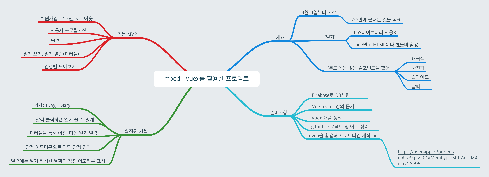
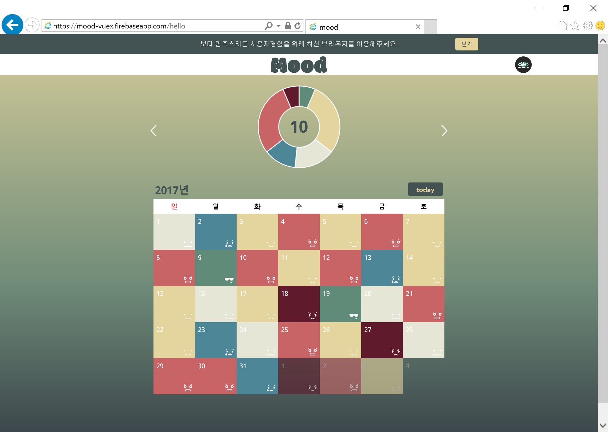

# Project - 'mood'
## 하루의 감정을 기록 할 수 있는 다이어리
### [무드 웹페이지](https://mood-vuex.firebaseapp.com) & [영상](https://youtu.be/k8K98UBskyA)

#### 개요  
패스트캠퍼스 프론트엔드 개발 스쿨 4기 수료 후 [지난 프로젝트](http://school.fastcampus.co.kr/outcomes/dev_fds/77/)에서 부족했던 부분들을 보충하고자 시작한 프로젝트입니다. 파이어베이스를 활용해 회원가입 및 로그인, 데이터베이스를 구현했으며 배포까지 진행했습니다. 
#### 팀 구성원  
  - 프론트엔드 - [고세민](https://github.com/degose/mood/tree/master)  
  - 프론트엔드 - [김태훈](https://github.com/realkth/mood/tree/master)  
#### 서비스 이름
  - 'a state or quality of feeling at a particular time' 이라는 의미의 영단어 'mood' => `무드`


```
주요 기능
1. 회원 가입 및 이메일 인증
2. 로그인
3. 회원 정보 설정 및 수정 (프로필 사진 및 유저 네임)
4. 달력 => 날짜를 선택해 해당 날짜에 작성
5. 일기 쓰기 및 수정
6. 감정 이모티콘으로 감정 기록 => 선택한 감정 이모티콘이 달력에 반영
7. 감정 선택 횟수 통계 => 도넛 차트로 감정 선택 횟수 통계를 시각화
8. 한달에 일기를 몇 번 기록했는지 통계 제공
```  


#### 활용 기술  
  - Vue.js
  - Vuex
  - Vue-router
  - axios
  - Scss
  - HTML
  - webpack
  - Firebase
  
#### 서비스 환경  
  - IE 9+ 크로스 브라우징 대응 
  - 반응형 및 터치 이벤트 지원으로 모바일 환경 대응   
  - 웹 접근성과 웹 표준 준수
  
#### 업무 분담 및 협업 방안
  - 기능별 분담
  - git 을 활용한 버전 관리
  - 페어 프로그래밍
  - 작업 분담은 깃헙의 [프로젝트](https://github.com/realkth/mood/projects/1)와 [이슈](https://github.com/realkth/mood/issues?q=is%3Aissue+is%3Aclosed)를 활용해서 관리
  - 작업 진행상황은 [스크럼보드](https://docs.google.com/spreadsheets/d/1i7tOWOv7eNiqQlEGzf7wO5ybKPk8lishXqrKqkRDrzU/edit?ts=59b76c7c#gid=0)를 활용해서 공유

--------------------------------------------
#### 기획
  
  - [프로토타입](https://ovenapp.io/project/npUx3Fpso9DVMvmLypjoMtRAopfM4gju#G6e95)  
  - [최종 디자인컨셉](https://goo.gl/TrM2Ps)

<!-- > ## 일별 진행사항은 [스크럼보드](https://docs.google.com/spreadsheets/d/1i7tOWOv7eNiqQlEGzf7wO5ybKPk8lishXqrKqkRDrzU/edit?ts=59b76c7c#gid=0)에 개인 별로 작성  
> ## 프로젝트 진행과정 : [프로젝트](https://github.com/realkth/mood/projects/1) / [이슈](https://github.com/realkth/mood/issues?q=is%3Aissue+is%3Aclosed) -->

--------------------------------------------
##### 완성된 페이지  
  
##### IE 페이지
  - 브라우저 감지를 통해 IE의 경우 최신브라우저 이용 안내메시지  



